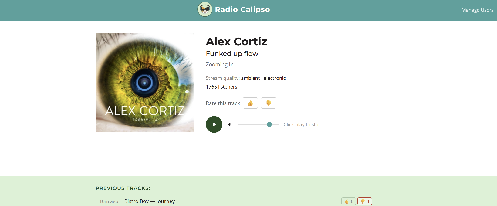

# Radio Calipso

A web-based internet radio player with live now-playing info, album art, and per-track thumbs up/down ratings.



## Features

- Live HLS stream playback (via hls.js, with native fallback for Safari/iOS)
- Now-playing display: artist, track, album, cover art, source/stream quality
- Previous tracks list
- Thumbs up / thumbs down rating for any track, per anonymous client (identified by an IP + user-agent hash, no login required)
- Volume control and mute

## Tech Stack

- **Backend:** Node.js + Express
- **Database:** SQLite via better-sqlite3
- **Frontend:** Vanilla JS, HTML, CSS
- **Stream:** HLS via [hls.js](https://github.com/video-dev/hls.js)
- **Testing:** `node:test` + `supertest` for unit/integration tests, Playwright for e2e

## Getting Started

### Prerequisites

- Node.js 18+

### Install & Run

```bash
git clone https://github.com/VolodymyrPanchenko/radio-calipso.git
cd radio-calipso
npm install
npm start
```

Open [http://localhost:3000](http://localhost:3000) in your browser.

For development with auto-reload:

```bash
npm run dev
```

### Docker

```bash
# production image
docker compose up -d

# development image, with live-reload and source bind-mounted
docker compose -f docker-compose.yml -f docker-compose.dev.yml up
```

Both serve on [http://localhost:3000](http://localhost:3000) (override with `PORT`). SQLite data persists in a named Docker volume.

### Tests

```bash
npm test              # unit/integration tests (node:test + supertest)
npm run test:coverage # same, with coverage
npm run test:e2e      # Playwright browser tests (run `npx playwright install chromium` once first)
```

## API

| Method | Endpoint | Description |
|--------|----------|-------------|
| GET | `/api/health` | Health check |
| GET | `/api/now-playing` | Current track metadata (proxied from the station's live metadata source) |
| GET | `/api/ratings?track=<key>` | Get up/down counts and the caller's own rating for a track |
| POST | `/api/ratings` | Submit or change a rating (`track`, `rating: "up"\|"down"`) |

## Project Structure

```
radio-calipso/
├── public/
│   ├── index.html        # Main player page
│   ├── player.js          # Audio player + HLS wiring
│   ├── now-playing.js      # Polls now-playing/ratings and updates the UI
│   ├── format-time.js      # Shared time-formatting helper (also unit tested)
│   └── style.css
├── src/
│   ├── db/
│   │   └── index.js        # SQLite connection + schema
│   ├── routes/
│   │   ├── now-playing.js  # GET /api/now-playing
│   │   └── ratings.js      # GET/POST /api/ratings
│   └── server.js           # Express app (exported for tests)
├── test/
│   ├── server/              # node:test + supertest
│   ├── client/               # node:test against public/*.js helpers
│   └── e2e/                   # Playwright specs
├── Dockerfile
├── docker-compose.yml
└── docker-compose.dev.yml
```

## License

ISC
